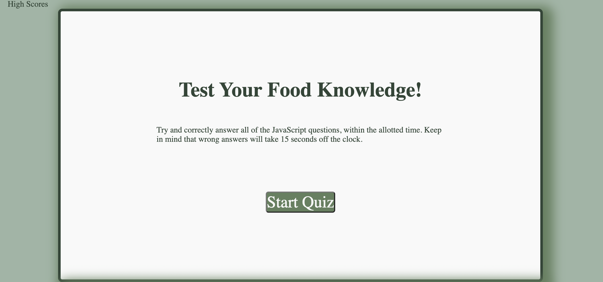

# code-quiz-hw

##

The purpose of the application is to have the user test their knowledge with fun food facts. The quiz is timed to make the application more like a game. They must try and answer all of the questions correctly before the time runs out. Additonally, if they answer a question incorrectly 10 seconds will be deducted from their score. They will recieve a score based on how many answer they answered correctly. They will be able to play the game multiple times with the user score saved. The quiz is not a neccessarily designed to solve a problem besides being a fun and interactive application. I personally, learned a lot from this project. This was my first application using jQuery without a base code, which was very challenging for me. I am excited to continuing to grow as a developer and get better and more comfortable with coding in jQuery/Java script.

##

Nothing is needed to install this application besides a browser.

//

````md
    
    ```
````

##

Used HTML, CSS, JQuery and JS to create this application!
